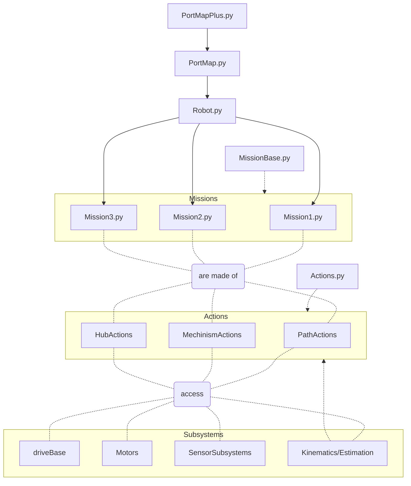

# FLL-Pre-Season-Code
Hello! this is a readme file to describe the repository. This repository is code for the FLL team #39131 Snowbotics team from Colorado.
The code in this repository is mostly python, as we are currently running pybricks on our lego mindstorms robots.

@UxuginPython
This is a big thing to work on I have been trying to think of an overall structure for the code 
here is one example I adapted from here https://github.com/Team254/FRC-2022-Public/tree/main/src/main/java/com/team254/frc2022/auto
here are the rules to the structure 
1. Robot.py runs missions
2. Missions are made of Actions
3. Actions can access subsystems
4. Actions can be made of other Actions
5. Subsystems include the default driveBase and motors as well as custom subsystems like the Estimation

Here is some of the code structure in a fancy mermaid chart:

