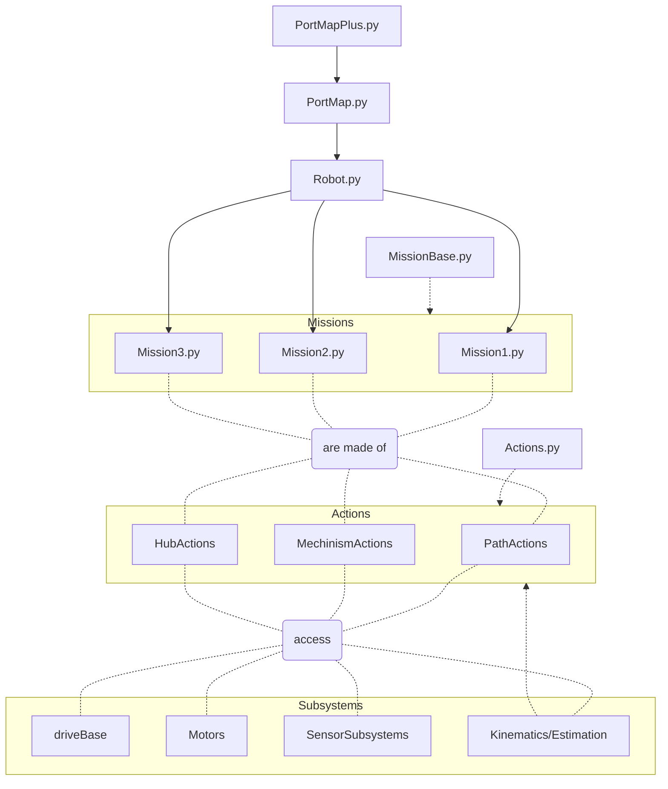

# FLL-Pre-Season-Code
Hello! this is a readme file to describe the repository. This repository is code for the FLL team #39131 Snowbotics team from Colorado.

Documentaion here -> (https://snowbotics39131.github.io/FLL-Pre-Season-Code/Framework.html)

The code in this repository is mostly python, as we are currently running pybricks on our lego mindstorms robots.

# Code Stucture

This structure was inspired by FRC Team 254s [auto code](https://github.com/Team254/FRC-2022-Public/tree/main/src/main/java/com/team254/frc2022/auto)

Here are the rules to the code structure 
1. Robot.py runs missions
2. Missions are made of Actions
3. Actions can access subsystems
4. Actions can be made of other Actions
5. Subsystems include the default driveBase and motors as well as custom subsystems like the Estimation

Here is some of the code structure in a fancy mermaid chart:

-----------------------------------------------------------------------------------------------------------------------------------
#License 
This project is licensed under the Creative Commons Zero (CC0) license. You are free to use, modify, and distribute this project without any restrictions.

